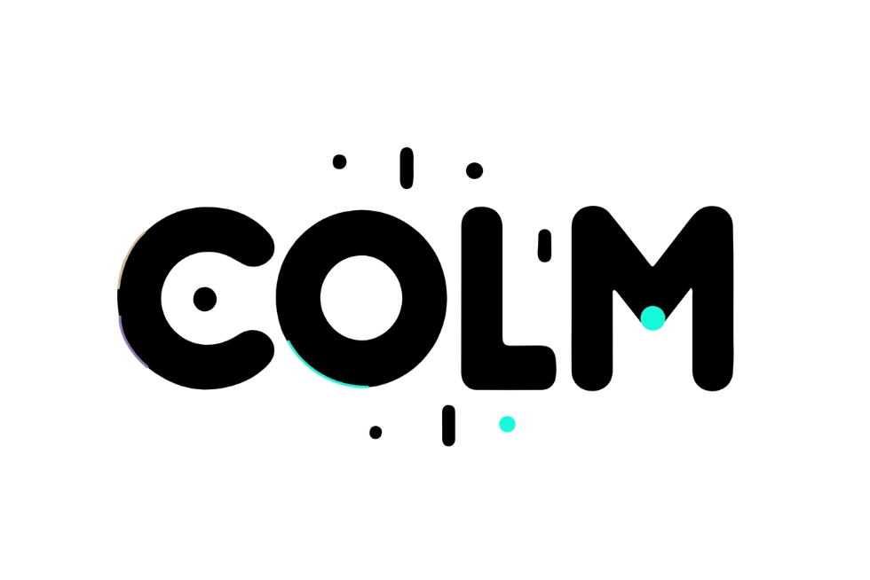
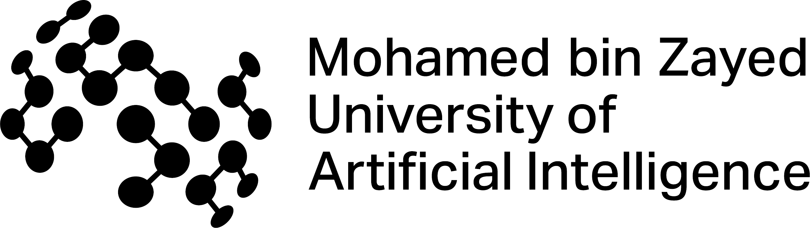

<p align="center">
  
  &nbsp;&nbsp;&nbsp;&nbsp;
  
</p>

  # unveiLing: What Makes Linguistics Olympiad Puzzles Tricky for LLMs?  

  <!-- <p align="left">
    
    &nbsp;&nbsp;
    
  </p> -->

<!-- <table>
  <tr>
    <td align="center" width="50%">
      
    </td>
    <td align="center" width="50%">
      
    </td>
  </tr>
</table> -->

  **Mukund Choudhary***, KV Aditya Srivatsa*, Gaurja Aeron, Antara Raaghavi Bhattacharya, Dang Khoa Dang Dinh, Ikhlasul Akmal Hanif, Daria Kotova, Ekaterina Kochmar, Monojit Choudhury

  ---

  ## 📄 Paper & Assets
  **Published at COLM 2025:** [OpenReview (paper + reviews)](https://openreview.net/forum?id=fcRcl1EXc4)

  **Invited Talk (researchtrend.ai panel):** [Watch the talk](https://youtu.be/2GwJ2sSVrVo?si=tkG2UkKydc06UcCC)

  **Google Drive:** [Brief breakdowns and the poster from COLM](https://drive.google.com/drive/folders/1NE8C1JPr5SRAjxL3h6LOjSjyLDrtaFSE?usp=drive_link)

  ---

  ## 🔍 Overview  

  This repository hosts the **linguistic feature annotations** and **LLM evaluation tables** used in our COLM 2025 paper, *unveiLing: What Makes Linguistics Olympiad Puzzles Tricky for LLMs?*.  
  The project examines **629 problems across 41 low-resource, unseen languages**, annotates each puzzle with **50+ WALS-style linguistic features**, and benchmarks 10 LLMs across 6 prompting strategies.

  As our paper and the quicker scroll on Twitter [here](https://x.com/mukundc2k/status/1959975588833161635) highlight, we found that the three main factors behind LLM failures on LO puzzles are morphological complexity, English-structure bias, and data-constraint sensitivity.

  The work contributes to a broader research direction on comparing **how LLMs structure language** versus **how humans do**, focusing on metalinguistic reasoning, feature-level linguistic behavior, and cognitive aspects of abstraction.

  ---


  ## 📁 Repository Contents

  ### **`rose_llm_scores.csv`**  
  LLM **exact-match accuracy** for each puzzle/problem across:  
  - 10 models (GPT, Llama2/3/3.1, Mixtral)  
  - 6 prompting styles  
  - Both translation directions (LRL→EN, EN→LRL)

  ### **`rose_attributes_and_features.csv`**  
  Detailed linguistic **feature and attribute annotations**, including:  
  - 50 WALS-based features  
  - Morphology / syntax / semantics / phonology classes  
  - Similarity to English  
  - Constrained-evidence metrics  

  These correspond directly to analyses in Sections **2–3** of the paper.

  ---

  ## 🔒 Why We Do Not Release the LO Puzzles  

  As described in **Sec. 2.1 (Data)** and the **Ethics Statement** of the paper:  

  - Many puzzles are copyrighted by national Linguistics Olympiads.  
  - Some sources intentionally **hide or zip** puzzles to prevent LLM contamination.  
  - To preserve the integrity of uncontaminated evaluation, we release only **annotations + mappings**, not the puzzles themselves.

  Where permitted, annotations can be used to locate the original public sources.

  ---

  ## 🤝 Contact, Collaboration & Research Direction  

  This work is part of my broader PhD research in NLP at MBZUAI (advised by Monojit Choudhury), where I explore **how LLMs structure language**. If you’re interested in the linguistics of LLMs, metalinguistic reasoning, cognitive structure in models, or probing how LLMs compare to humans:

  **Email:** [mukund.choudhary@mbzuai.ac.ae](mailto:mukund.choudhary@mbzuai.ac.ae)

  ---

  ## ✍️ Citation  

  ```bibtex
@inproceedings{choudhary2025unveiling,
  title        = {unveiLing: What Makes Linguistics Olympiad Puzzles Tricky for LLMs?},
  author       = {Choudhary, Mukund and Srivatsa, KV Aditya and Aeron, Gaurja and 
                  Bhattacharya, Antara Raaghavi and Dinh, Dang Khoa Dang and 
                  Hanif, Ikhlasul Akmal and Kotova, Daria and Kochmar, Ekaterina 
                  and Choudhury, Monojit},
  booktitle    = {Proceedings of the Conference on Language Modeling (COLM)},
  year         = {2025},
}

